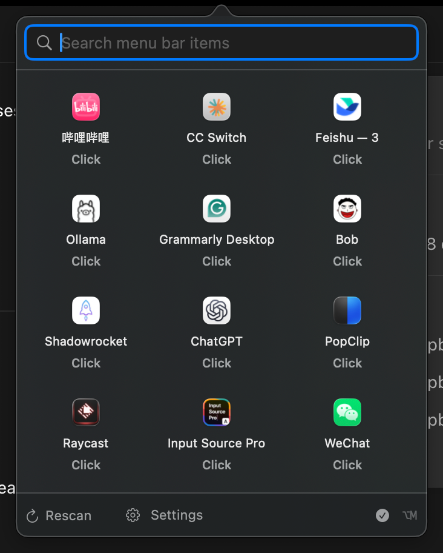

# Menu Hub for macOS

English | [简体中文](README.zh-CN.md)

[Download the latest release](https://github.com/Talljack/menu-hub/releases/latest) · macOS 14 or later · Apple Silicon and Intel

Menu Hub is a native macOS menu bar manager. Click its four-petal icon to search, identify, organize, and activate the menu bar items from your running apps.

<p align="center">
  
</p>

Menu Hub is built with Swift 6, SwiftUI, and AppKit. It uses public macOS APIs only. There is no Electron, code injection, Screen Recording permission, analytics SDK, cloud service, or account.

## Install

1. Open the [latest GitHub Release](https://github.com/Talljack/menu-hub/releases/latest).
2. Download the DMG that matches your Mac:

   | Mac | Download |
   | --- | --- |
   | Apple M1, M2, M3, M4, or newer | `Menu-Hub-*-macos-arm64.dmg` |
   | Intel processor | `Menu-Hub-*-macos-x86_64.dmg` |

   To check your Mac, choose Apple menu > About This Mac and look at **Chip** or **Processor**.
3. Open the DMG and drag **Menu Hub** into **Applications**.
4. Eject the DMG, then open Menu Hub from Applications or Spotlight.
5. Look for the four-petal Menu Hub icon in the menu bar. Menu Hub is a menu bar app, so it does not show a Dock icon or a normal main window.

ZIP packages and SHA-256 checksum files are provided on the same Release page for users who prefer them. Official releases are signed with Developer ID, notarized by Apple, and checked by Gatekeeper.

To update Menu Hub, quit the running version and drag the newer app into Applications, replacing the existing copy.

## Grant Accessibility permission

Accessibility permission lets Menu Hub discover supported menu bar items and invoke their normal click action. Without it, Menu Hub remains usable in a limited app-launcher mode. Screen Recording permission is not required.

1. Open Menu Hub and follow the first-run explanation, or open **Settings > Permissions & Privacy**.
2. Click **Open System Settings**.
3. In **Privacy & Security > Accessibility**, enable **Menu Hub**.
4. If Menu Hub is not listed, click `+` and select `/Applications/Menu Hub.app`.
5. Return to Menu Hub. It rechecks permission when it becomes active, then scans again.

If the switch is already enabled but Menu Hub still reports no access:

1. Open **Menu Hub > Settings > Permissions & Privacy**.
2. Choose **Repair Permission** and confirm.
3. Enable Menu Hub again in System Settings, then reopen the panel or click **Rescan**.

Repair Permission resets only Menu Hub's own `com.local.MenuHub` Accessibility entry. It does not change another app's permission.

## Use Menu Hub

- Click the four-petal menu bar icon to open or close the panel.
- Press `⌥M` from any app to toggle the panel. Change this shortcut in **Settings > Shortcuts** if needed.
- Type an app or item name to search. Each result leads with its host app name so similar icons remain distinguishable.
- Click an item to perform its normal menu bar action. If direct activation is unavailable, Menu Hub can open the known host app instead.
- Option-click the Menu Hub icon to hide or reveal the managed menu bar area.
- Right-click the icon to rescan, open Settings, restore the menu bar, or quit.
- Favorites, Recent, Frequent, custom groups, aliases, ordering, and ignored items are managed under **Settings > Items & Groups**.

### Keyboard controls

| Shortcut | Action |
| --- | --- |
| `⌥M` | Open or close Menu Hub globally |
| `↑` / `↓` | Move the selection |
| `Return` | Run the selected item's default action |
| `⌘Return` | Open the selected item's host app |
| `⌘K` | Open the selected item's action menu |
| `⌘1` through `⌘9` | Activate a favorite |
| `⌘F` | Focus search |
| `Esc` | Clear search, then close the panel |

## Language

Menu Hub supports 10 languages: English, 简体中文, 繁體中文, 日本語, 한국어, Español, Français, Deutsch, Português (Brasil), and Русский. Choose **Settings > General > Language** to follow macOS or select a language explicitly. System Default matches supported regional variants (for example, `zh-TW` uses 繁體中文); unsupported system languages fall back to English. Reopen a window after changing the language, or restart Menu Hub if text in an existing window has not refreshed.

## Privacy and local data

Catalogs, favorites, aliases, groups, preferences, and usage history stay on this Mac under:

```text
~/Library/Application Support/Menu Hub/
```

Menu Hub does not send analytics or user data anywhere. Diagnostics are exported only after you choose a destination and redact or hash home paths, user names, search text, and stable item identifiers.

## Public API limitations

macOS does not provide a public API that guarantees discovery, movement, hiding, or proxy activation for every third-party menu bar item. Menu Hub uses a transparent variable-width `NSStatusItem` for layout space and Accessibility APIs for discovery and activation.

- Clock, Control Center, and other system-managed items are outside the hiding guarantee.
- Items without stable Accessibility metadata or `AXPress` support may only open their host app or remain unavailable.
- Long foreground-app menus, notched displays, and display changes can still make macOS clip items. Menu Hub restores a safe revealed state when the layout becomes uncertain.
- Compatibility can vary with macOS, display arrangement, and third-party app versions.

## Build and test locally

Install XcodeGen and a Swift 6 toolchain, then run:

```sh
xcodegen generate
swift test
xcodebuild test \
  -project MenuHub.xcodeproj \
  -scheme MenuHub \
  -destination 'platform=macOS' \
  -skip-testing:MenuHubUITests \
  CODE_SIGNING_ALLOWED=NO
```

Build native Apple Silicon and Intel release artifacts with:

```sh
./scripts/build-release.sh
```

The root `VERSION` file is the version source of truth and must match `MARKETING_VERSION` in `project.yml`.

## CI releases

Every push or merge to `main` runs [.github/workflows/release.yml](.github/workflows/release.yml), tests the project, builds both chip architectures, and uploads architecture-specific DMG and ZIP artifacts.

A `v*` tag produces a GitHub Release. With the protected `release` environment configured, CI imports the Developer ID certificate, signs both apps, submits them to Apple's notary service, staples the tickets, validates all eight release assets, and publishes the release after approval.

## Documentation

- [Local validation report](outputs/LocalValidationReport.md)
- [MVP comparison audit](outputs/MVP-Comparison-Audit.md)
- [Release checklist](docs/ReleaseChecklist.md)
- [Phase 0 manual test checklist](docs/Phase0ManualTestChecklist.md)
- [Phase 0 feasibility report](FeasibilityReport.md)
